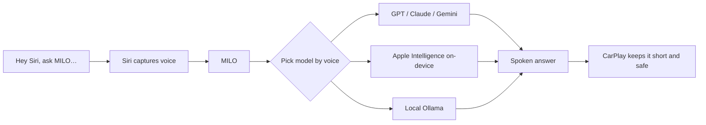

# Hands-free AI for Siri and CarPlay

MILO lets you say "Hey Siri, ask MILO…" and routes your voice to GPT, Claude,
Gemini, or 200+ other models — from the lock screen, your headphones, or the car.

[**Try the beta &rarr;**](https://testflight.apple.com/join/rea1m7wb) &nbsp;·&nbsp; [**Report a bug**](https://github.com/luongnv89/milo-website/issues/new?template=bug_report.yml&labels=bug) &nbsp;·&nbsp; [**Request a feature**](https://github.com/luongnv89/milo-website/issues/new?template=feature_request.yml&labels=enhancement)

---

## Report a bug or request a feature

This repo is where MILO's feedback lives. Pick the form that fits — each one
comes pre-filled, and a free GitHub account is all you need.

| I want to… | Open this |
|---|---|
| Report something broken | [Bug report](https://github.com/luongnv89/milo-website/issues/new?template=bug_report.yml&labels=bug) |
| Pitch a model, shortcut, or workflow | [Feature request](https://github.com/luongnv89/milo-website/issues/new?template=feature_request.yml&labels=enhancement) |
| Ask a question or share praise | [General feedback](https://github.com/luongnv89/milo-website/issues/new?template=feedback.yml) |

MILO is built and used daily by one person. Every issue is read.

## What MILO does



On iOS, only Siri can be triggered hands-free system-wide. MILO hands that voice
off to the model you choose — so you get a real AI answer while driving, walking,
or multitasking.

| Feature | What you get |
|---|---|
| Hands-free | Trigger via Siri from lock screen, headphones, or CarPlay |
| Made for the car | CarPlay mode keeps answers short and spoken |
| 200+ models | 8 providers plus on-device Apple Intelligence and local Ollama |
| Switch by voice | Change models mid-conversation without touching the screen |
| Private by default | Keys in the iOS Keychain; history stays on-device via SwiftData |
| Bring your own keys | Pay providers directly; many have free tiers |

## Get the beta

1. Install Apple's free [TestFlight](https://apps.apple.com/app/testflight/id899247664) app.
2. Open the [MILO invite link](https://testflight.apple.com/join/rea1m7wb).
3. Tap Install — it works like a normal app. Requires iOS 17.6+.

The public App Store release is coming soon.

## This repo

This is the source for MILO's marketing site, [askmilo.pro](https://askmilo.pro).
It doubles as the public issue tracker for the app.

```bash
npm install
npm run dev      # start the dev server
```

<details>
<summary>Tech stack & local development</summary>

- [Vite](https://vitejs.dev/) + [React 19](https://react.dev/)
- [Tailwind CSS v4](https://tailwindcss.com/)
- Deployed to **GitHub Pages** via GitHub Actions

```bash
npm install
npm run dev      # start the dev server
npm run build    # production build to dist/
npm run preview  # preview the production build locally
```

</details>

<details>
<summary>Deployment</summary>

Every push to `main` triggers [`.github/workflows/deploy.yml`](.github/workflows/deploy.yml),
which builds the site and publishes `dist/` to GitHub Pages.

The site is served from the apex domain `askmilo.pro` (set via
[`public/CNAME`](public/CNAME)), so [`vite.config.js`](vite.config.js) sets
`base: '/'`.

> **GitHub Pages setup:** Settings &rarr; Pages &rarr; Source = **GitHub Actions**.

</details>
